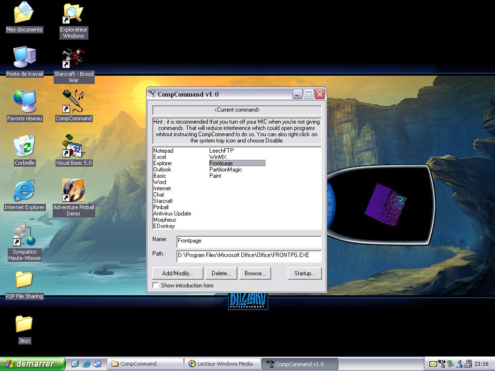

## Launch APPs using Voice Recognition

### Description

You don't need anymore to click on icons or browse the start menu : you just have to say the name of the app and it opens it! Fully customizable, an option to run the program at system startup...
 
### More Info
 
You need the MS Agent Speech Engines. Main componements + speech recognition engine.

If the PhraseFinish event never raises, it's because you don't have all the necessary MS Agent componements.

             |
---                |---
**Submitted On**   |2002-04-15 21:17:32
**By**             |[RMD Software](https://github.com/Planet-Source-Code/PSCIndex/blob/master/ByAuthor/rmd-software.md)
**Level**          |Intermediate
**User Rating**    |4.2 (21 globes from 5 users)
**Compatibility**  |VB 5\.0, VB 6\.0
**Category**       |[Sound/MP3](https://github.com/Planet-Source-Code/PSCIndex/blob/master/ByCategory/sound-mp3__1-45.md)
**World**          |[Visual Basic](https://github.com/Planet-Source-Code/PSCIndex/blob/master/ByWorld/visual-basic.md)
**Archive File**   |[Launch\_APP723934152002\.zip](https://github.com/Planet-Source-Code/rmd-software-launch-apps-using-voice-recognition__1-33847/archive/master.zip)

